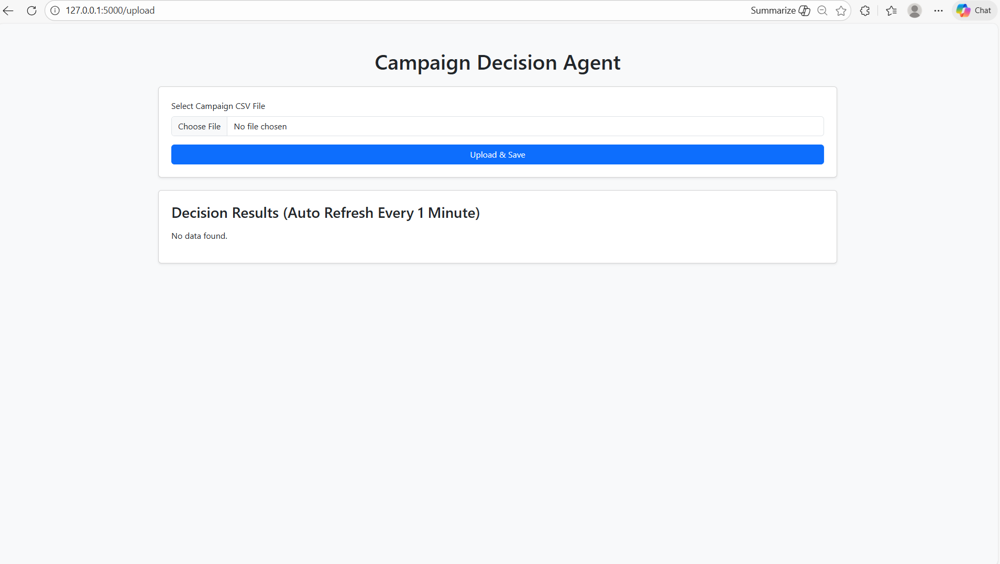
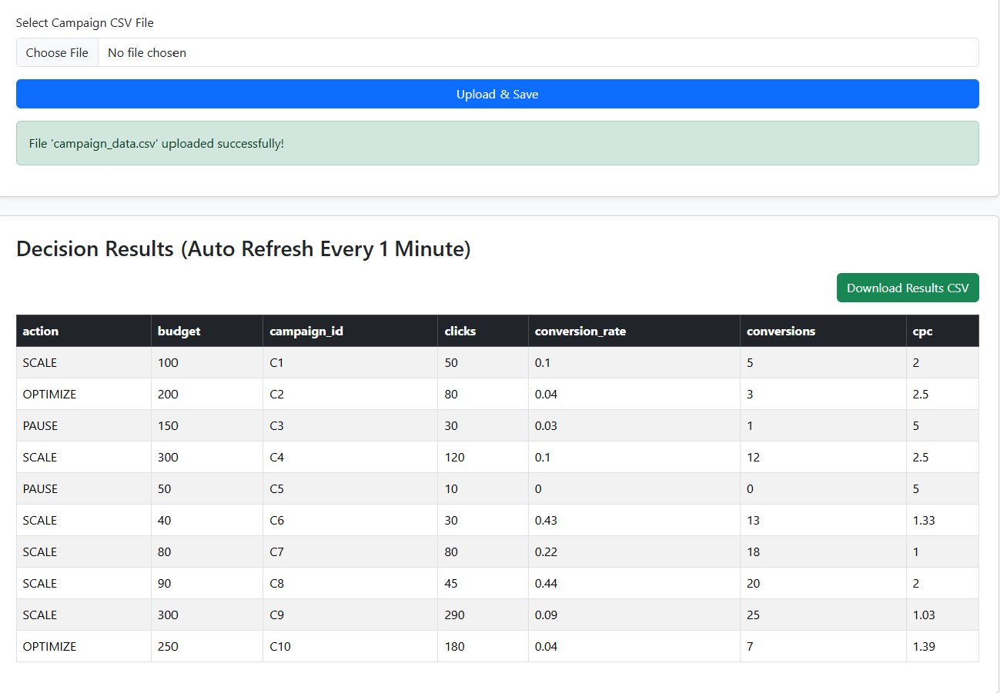

### Campaign Decision Agent Dashboard

This project is a Flask-based web dashboard designed to help marketing teams make quick, data-driven decisions on campaign performance.
Users can upload campaign data in CSV format, and the system automatically applies business rules to recommend actions such as scaling, optimizing, or pausing campaigns.

The goal of this project is to demonstrate end-to-end application development, combining data processing, business logic, APIs, and a clean user interface.

## Key Features

- Upload campaign performance data using a CSV file

- Automatically compute key metrics like CPC and conversion rate

- Apply clear, rule-based logic to generate campaign decisions

- Display results in a dynamic table that refreshes every minute

- Download the final decision output as a CSV file

- Simple, clean, and responsive UI built with Flask and HTML

## Campaign Decision Logic (Business Rules)

The decision engine follows straightforward and transparent rules:

SCALE → CPC < 3 and conversion_rate > 0.05

OPTIMIZE → CPC < 5

PAUSE → All other cases

These rules are implemented to mimic how marketing teams evaluate campaign efficiency and performance.

## Application Screenshots
Before Data Upload
 

After Data Upload and Decision Results
 
 
## Folder Structure
agent_api/
│
├── app.py                  # Flask application entry point
├── requirements.txt        # Project dependencies
├── data/
│   └── campaign_data.csv   # Sample input data
├── agent/
│   ├── feature_engineering.py  # Derived metrics (CPC, conversion rate)
│   ├── decision_agent.py       # Business rule engine
│   └── schemas.py              # Data validation schemas
├── templates/
│   └── upload.html         # UI for file upload and results
└── README.md

## How to Run the Project

Clone the repository

Create and activate a virtual environment

## Install dependencies

pip install -r requirements.txt

## Run the Flask application

python app.py

## Open your browser and go to:

http://127.0.0.1:5000

